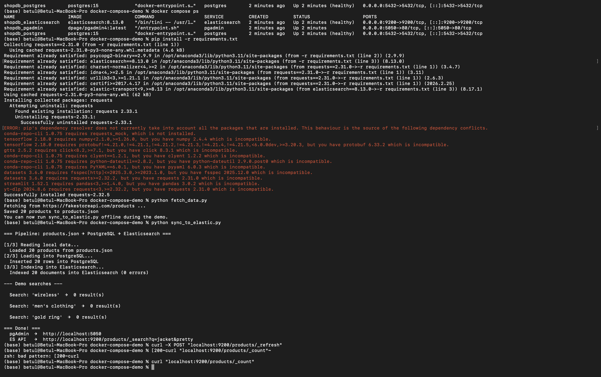
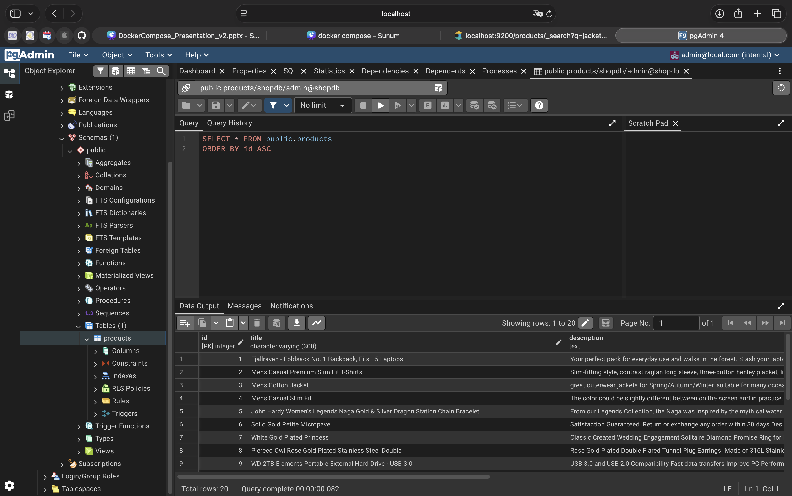
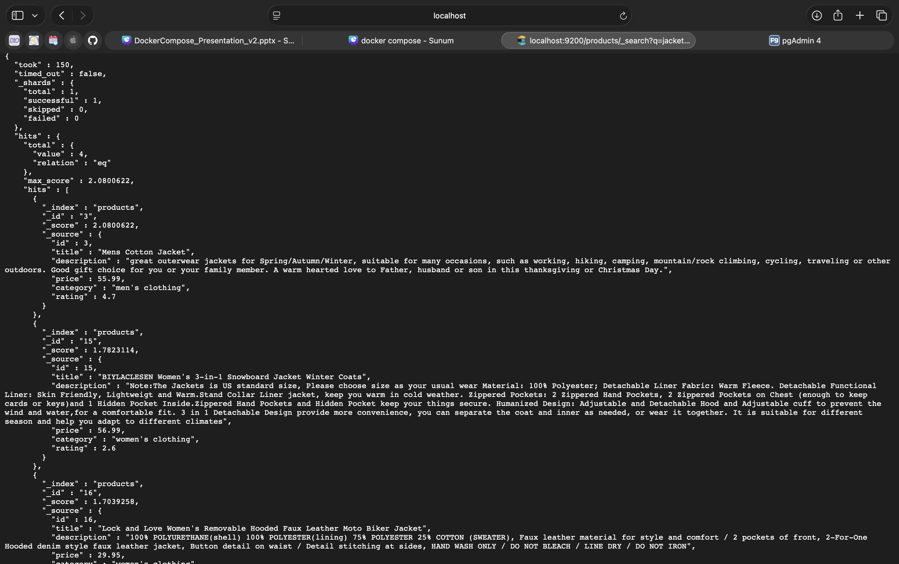
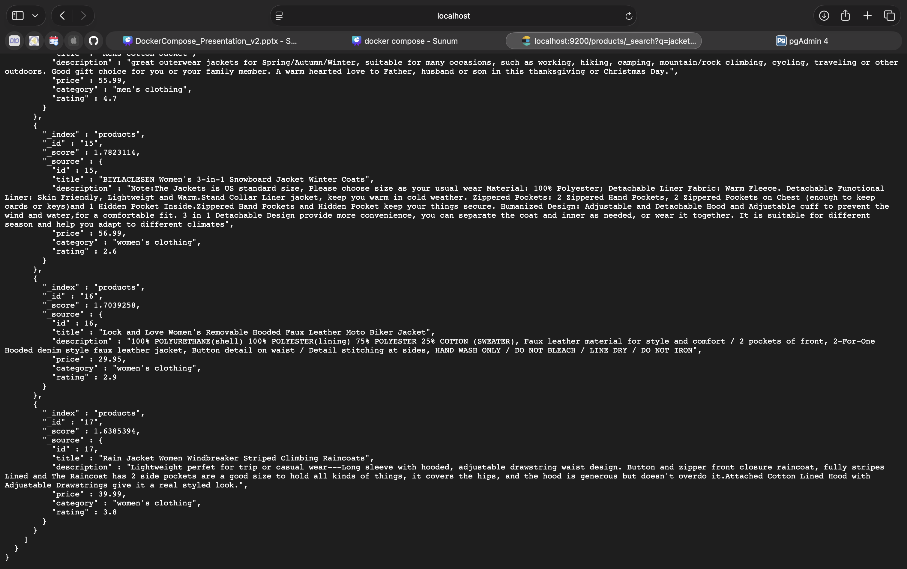

# Docker Compose Demo — PostgreSQL + pgAdmin + Elasticsearch

**YZV 322E — Applied Data Engineering | Spring 2026**
**Şeyma Betül İskender · 150220342**
 [github.com/betul0303/docker-compose-demo](https://github.com/betul0303/docker-compose-demo)

---

## 1. What is this tool?

Docker Compose is a tool for defining and running multi-container Docker applications using a single YAML configuration file (`docker-compose.yml`). Instead of starting each container manually with long `docker run` commands, you describe your entire stack in one file and bring it up with a single command. This demo runs three services together: **PostgreSQL** (relational database), **pgAdmin** (visual database management UI), and **Elasticsearch** (full-text search engine).

---

## 2. Prerequisites

| Requirement | Version |
|---|---|
| Docker Desktop | 4.x or later (includes Compose V2) |
| Python | 3.8+ |
| pip | latest |
| RAM | 4 GB minimum (Elasticsearch needs ~512 MB) |

Verify Docker Compose is available:
```bash
docker compose version
# Expected: Docker Compose version v2.x.x
```

---

## 3. Installation

```bash
# 1. Clone the repository
git clone https://github.com/betul0303/docker-compose-demo.git
cd docker-compose-demo

# 2. Install Python dependencies
pip install -r requirements.txt

# 3. Start all three services
docker compose up -d
```

Verify all containers are running:
```bash
docker compose ps
```

Expected output:
```
NAME                    STATUS              PORTS
shopdb_elasticsearch    Up (healthy)        0.0.0.0:9200->9200/tcp
shopdb_pgadmin          Up                  0.0.0.0:5050->80/tcp
shopdb_postgres         Up (healthy)        0.0.0.0:5432->5432/tcp
```

---

## 4. Running the Example

### Step 1 — Fetch data from Fake Store API (run once)
```bash
python fetch_data.py
```
This fetches 20 real products from [fakestoreapi.com](https://fakestoreapi.com/products) and saves them to `products.json`. After this step you can run the demo fully offline.

### Step 2 — Run the pipeline
```bash
python sync_to_elastic.py
```
This script:
- Reads `products.json`
- Creates the `products` table in PostgreSQL and inserts all rows
- Creates an Elasticsearch index and bulk-indexes all documents

### Step 3 — Open pgAdmin
Go to **http://localhost:5050** in your browser.

Login credentials:
- Email: `admin@local.com`
- Password: `admin`

Add a new server:
- Host: `postgres`
- Port: `5432`
- Database: `shopdb`
- Username: `admin`
- Password: `secret`

Navigate to `shopdb → Schemas → public → Tables → products` → right-click → **View/Edit Data → All Rows**

### Step 4 — Search with Elasticsearch
```bash
curl "localhost:9200/products/_search?q=jacket&pretty"
```

---

## 5. Expected Output

### Pipeline output (`sync_to_elastic.py`)


### pgAdmin — products table (20 rows from PostgreSQL)


### Elasticsearch — full-text search results for "jacket" (page 1)


### Elasticsearch — full-text search results for "jacket" (page 2)


---

## 6. AI Usage Disclosure

I used **Claude (claude.ai)** as a support tool during this project.

I independently researched Docker Compose, decided on the demo scenario (PostgreSQL + pgAdmin + Elasticsearch), and prepared the presentation narrative and slide content. I used Claude for assistance with:
- Boilerplate code structure for `docker-compose.yml`, `fetch_data.py`, and `sync_to_elastic.py`
- README formatting suggestions

I reviewed, tested, and adjusted all AI-assisted output before submission. I ran the full demo end-to-end on my local machine and verified that everything works correctly.
